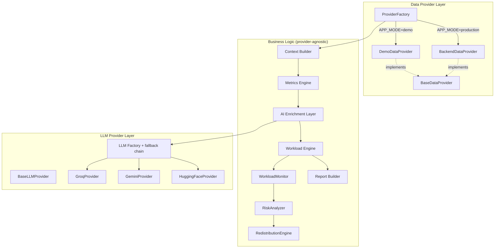
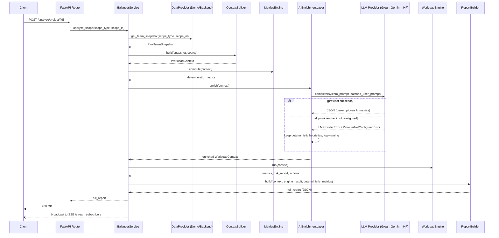

# SyncVerse Workload Analysis Service

AI-enriched workload monitoring, imbalance detection, and redistribution
recommendations for SyncVerse engineering teams. Deterministic metrics are
computed in pure Python; only metrics that genuinely cannot be derived from
the database are estimated by an LLM. **All recommended actions require
human approval — nothing is auto-executed.**

This is a refactor of the original Workload Analysis feature, not a
rewrite: the deterministic `WorkloadMonitor -> RiskAnalyzer ->
RedistributionEngine` pipeline is preserved unchanged; everything around it
(data sourcing, AI enrichment, demo/production modes) is new.

---

## Architecture

```
        Data Provider              (Backend REST API  |  Demo JSON)
              |
        Context Builder            raw data -> unified WorkloadContext
              |
        Metrics Engine             deterministic team-level aggregates
              |
        AI Enrichment              ONE batched LLM call — only for
              |                    metrics that can't be computed
              |
        Workload Engine            preserved: WorkloadMonitor ->
              |                    RiskAnalyzer -> RedistributionEngine
              |                    (never calls the LLM)
              |
        Report Builder             assembles the final API response
```

### Component diagram



### Sequence diagram — `POST /api/v1/workload/analyze/{scope_type}/{scope_id}`



---

## Folder structure

```
app/
  config.py                # ALL thresholds/weights/timeouts/retries — env-driven
  core/
    exceptions.py           # custom exception hierarchy
    logging.py               # structured logging + timed() context manager
  models/
    schemas.py               # Employee/Task/BalanceReport (preserved, extended)
    raw.py                    # provider-facing models mirroring the SyncVerse DB
    context.py                 # unified WorkloadContext
    ai_models.py                 # AIEstimatedValue wrapper + enrichment shapes
  providers/
    base.py / demo_provider.py / backend_provider.py / factory.py
  context/
    builder.py                # raw snapshot -> WorkloadContext
  engine/
    metrics_engine.py         # deterministic team aggregates
    workload_engine.py         # wraps the preserved balancing pipeline
  ai/
    base.py / groq_provider.py / gemini_provider.py / huggingface_provider.py
    factory.py                 # ordered fallback + retry
    enrichment.py               # ONE batched LLM call per analysis run
  balancing/                  # PRESERVED, unchanged
    workload_monitor.py / risk_analyzer.py / redistribution_engine.py
  report/
    report_builder.py          # assembles the final API response
  services/
    balancer_service.py        # orchestrates the whole pipeline + SSE fan-out
  routes/
    balancer_routes.py          # FastAPI endpoints
  data/
    demo/*.json                  # 6 realistic scenarios
    sample_data.py                # legacy in-memory scenarios (back-compat)
  main.py
docs/
  DATABASE_ANALYSIS.md          # Phase 1 deliverable — DB → metric mapping
scripts/
  generate_demo_data.py          # regenerates app/data/demo/*.json
tests/
  unit/ integration/ mocks/
```

---

## Demo Mode

```bash
APP_MODE=demo uvicorn app.main:app --reload
```

Never calls the backend, never requires a database. Six scenarios ship
under `app/data/demo/`, generated from `scripts/generate_demo_data.py`:

| Scenario (`scope_id`) | What it demonstrates |
|---|---|
| `normal_project` | Balanced team, no action needed |
| `overloaded_team` | One person drowning, others fine |
| `underutilized_team` | Plenty of slack |
| `delayed_project` | Overdue tasks with blocking dependencies |
| `high_priority_project` | Everything urgent, tight team |
| `critical_project` | Multiple overloaded, cascading risk |

```bash
curl -X POST http://localhost:7860/api/v1/workload/analyze/project/overloaded_team
```

Demo mode runs the **exact same pipeline** as Production — only
`DemoDataProvider` differs from `BackendDataProvider`.

## Production Mode

```bash
APP_MODE=production
BACKEND_API_BASE_URL=https://your-backend.example.com
BACKEND_API_KEY=...
```

Reads exclusively from Backend REST endpoints (see the contract documented
at the top of `app/providers/backend_provider.py`) — **never** connects to
`SyncVerseDB` directly. Failed endpoints are retried (Tenacity, exponential
backoff) and, if still unavailable, are recorded as
`data_quality_warnings` in the response rather than failing the whole
request.

## AI Enrichment

Only metrics that cannot be derived mathematically from the schema are
AI-estimated (full mapping in `docs/DATABASE_ANALYSIS.md` §3–4): task
difficulty/complexity, burnout indicator, productivity trend, focus
capacity, context-switching cost, collaboration difficulty, priority
weight, and availability score. Every one of them is returned in this
shape:

```json
{"value": "...", "source": "ai_estimated", "confidence": 0.84, "reason": "..."}
```

All employees are scored in **one** batched LLM call per analysis run
(never one call per employee or per metric). If no `GROQ_API_KEY` /
`GEMINI_API_KEY` / `HUGGINGFACE_API_KEY` is set, or every provider fails,
enrichment is skipped and the pipeline continues on deterministic
heuristics — it never fails the request.

## Environment variables

See `.env.example` for the full, documented list (app mode, backend API,
LLM providers, thresholds/weights, optional SQLite persistence, CORS).

## API Endpoints

| Method | Path | Description |
|---|---|---|
| POST | `/api/v1/workload/analyze/{scope_type}/{scope_id}` | Full pipeline (Demo or Production per `APP_MODE`) |
| GET | `/api/v1/workload/scopes` | Available scopes (Production) / demo scenarios (Demo) |
| GET | `/api/v1/workload/mode` | Current `APP_MODE` |
| GET | `/api/v1/workload/stream` | SSE real-time stream |
| GET | `/api/v1/workload/status` | Last computed report (polling fallback) |
| POST | `/api/v1/workload/analyse` | **Legacy**: direct employee/task payload, deterministic-only |
| POST | `/api/v1/workload/simulate/{scenario}` | **Legacy**: canned in-memory scenarios |
| GET | `/health` | Health check (reports `app_mode`) |

## Railway Deployment

```bash
railway up
```

- `Dockerfile`: Python 3.11-slim, non-root user, shell-form `CMD` so
  `${PORT}` (injected by Railway) is respected.
- `railway.json`: Dockerfile build, `/health` health check, restart on
  failure.
- No GitHub, Redis, PostgreSQL, or vector DB required. SQLite is only used
  if `ENABLE_SNAPSHOT_PERSISTENCE=true`, and never for core functionality.

## Testing

```bash
pytest tests/ -q
```

`tests/unit` covers the Context Builder, AI Enrichment (with a
`MockLLMProvider` — no network/API keys needed), and the Metrics Engine.
`tests/integration` exercises the full pipeline through the FastAPI
`TestClient` in Demo mode. `tests/mocks` holds the fake data/LLM providers
used throughout. All tests run offline.
